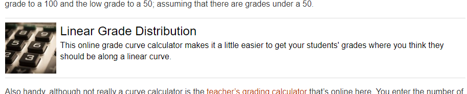

# Block Link Shortcode

I was looking for a nice, easy way to embed internal links on a site without going to just plain text links. Lifehacker does a really good job of internal links, and I modeled this plugin a bit from their style.

## What's it do?

With the code from `block_link.php` added to your theme `functions.php` you'll get a new shortcode `[block_link]`. You can use it in 3 different ways.

* `[block_link id=#]` will embed the post or page by database ID
* `[block_link slug="permalink"]` will embed the post or page by permalink
* `[block_link url="url_to_page"]` will embed the post or page by trying to determine by URL. It does need to be a URL on your site.

Assuming that it can figure out what post you're trying to embed it'll kick out the HTML to build the block link.

## What's it look like?

I originally wrote this shortcode snippet for my site [CompSci.rocks](https://compsci.rocks). You can see a block link in action on the page for a [square root curve calculator](https://compsci.rocks/square-root-curve/).

Be sure to look at the SASS file in this repo to see how the link is styled. The actual link is wrapped in quite a few styles, and the included SASS makes it look like the screen shot with some help from flexboxes.

## Installation

It didn't seem worthwhile to split this off into a separate plugin, so I just dumped the code from `block_link.php` in this repo into the `functions.php` file for my theme. Such a small little snippet just didn't seem to warrant a separate plugin.

To use with your theme just paste the code from `block_links.php` into your theme `functions.php` file. If that doesn't make sense to you, there's a pretty good explanation on [WordPress.org](https://developer.wordpress.org/themes/basics/theme-functions/).

## Images, Title and Excerpts

The title comes from the post title that you're linking to.

The subtext is pulled from one of several different places, in this order. It will first look for an excerpt that you've entered for the post. If the execrpt is empty it will look to meta data from the Yoast SEO plugin. First meta description, then the Facebook description and then the Twitter description.

The same thing happens for the image. First choice is the featured image. Then it will look to Yoast Facebook and Twitter images. 

## Customization

Do whatever you want with the SASS in `block_links.scss`. What's there is what I'm using on my sites, but you can tweak it however you want.
